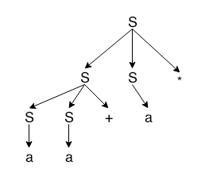
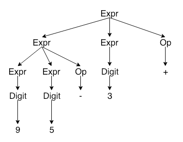
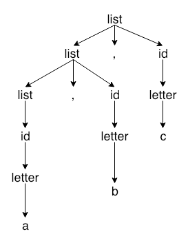
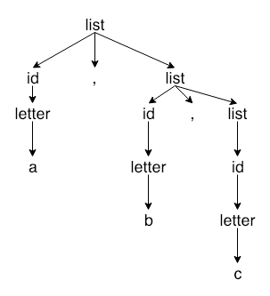
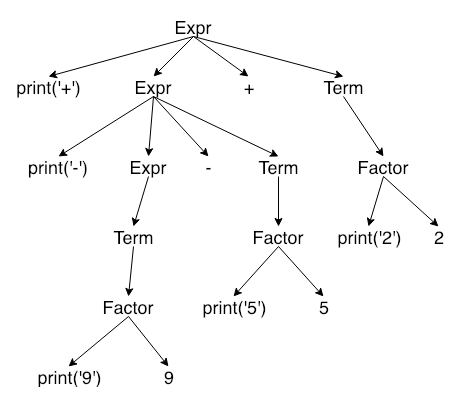
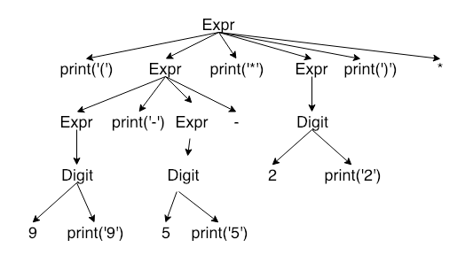
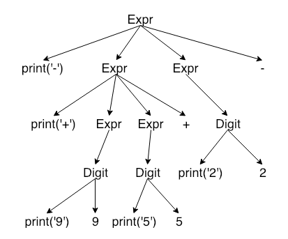

#### Exercise 2.2.1: Consider the context-free grammar 

S -> SS+ | SS* | a 

#### Show how the string aa+a* can be generated by this grammar. Construct the parse tree for this string, and what language does this grammar generate?

Given the grammar:

```
S -> SS+ | SS* | a
```

We can generate `aa+a*` like the following:

```
S -> SS*
S -> SS+S* 
S -> aS+S* 
S -> aa+S*

S -> aa+a*
```

The above generates a postfix expression. Example: `9 5 + 3 *` would result in `(9 + 5) * 3 = 42`.

Visualizing this tree:



#### Exercise 2.2.2: What language is generated by the following grammars? In each case justify your answer.

a) S -> 0S1 | 01

It generates the language of a string of consecutive N 0s, followed by a string of consecutive N 1s. The string will always end with a 1. 

Example: N=2: 0011, N=3: 000111. 

b) S -> +SS | -SS | a

A string prefixed by +, or -, followed by more +/-, ending with 1 or 2 a.

c) S -> S(S)S | ϵ

A set of open and closed (, ) which are wrapped and terminated correctly. Ex: ()(())() 

d) S -> aSbS | bSaS | ϵ 

Generates a string with equal number of a and b. Ex: ababab, abbaababbbaaba

e) S -> a | S + S | SS | S* | (S)

A regular expression.

#### Exercise 2.2.3: Which of the grammar in Exercise 2.2.2 are ambiguous?

a) No
b) No
c) Yes
c) Yes
d) Yes

#### Exercise 2.2.4: Construct unambiguous conext-free grammars for each of the following languages. In each case show that your grammar is correct.

a) Arithmetic expressions in postfix notation.

```
Expr -> Expr Expr Op | Digit 
Op -> + | - | * | /
Digit -> 0 | 1 | 2 | 3 | 4 | 5 | 6 | 7 | 8 | 9
```

Given: 9 5 - 3 +



b) Left-associative lists of identifiers separated by commas

```
list -> list , id | id
id -> letter | ϵ
letter -> a | ... | z
```

Given: a, b, c:



c) Right-associative lists of identifiers separated by commas.

```
list -> id , list | id
id -> letter | ϵ
letter -> a | ... | z
```

Given: a, b, c



d) Arithmetic expressions of integers and identifiers with four binary operators: +, -, *, /.

```
expr -> expr + term | expr - term | term
term -> term * factor | term / factor | factor
factor -> id | numbers | ( expr )
number -> digits number | digits | ϵ
id -> letters id | letters | ϵ
letters -> a | ... | z
digits -> 0 | ... | 9
```

#### Exercise 2.2.5: a) Show that all binary strings generated by the following grammar have values divisible by 3. Hint. Use induction on the number of nodes in a parse tree. b) Does the grammar generate all binary strings with values divisble by 3?

```
num -> 11 | 1001 | num 0 | num num
```

a) Yes, all strings which are generated by the above grammar generate binary values which are divisible by 3. In order for the binary value to be divisible by 3, the string must generate `11` (3), `10` (2), or `01` (1) as the last two characters for the value to be divisible by 3. For strings that need to generate `11`, the use of production `num -> 11` works. For `10`, the production `num -> num 0`, followed by any other production will work. And finally, for `01`, the production `num -> 1001`, or `num -> num num` can work.

b) No, this grammar will not be able to generate the decimal value 21, which is `10101`.

#### Exercise 2.2.6: Construct a context-free grammar for roman numerals.

Assume that we want to generate a grammar for Roman numbers from 1 - 3999. What would be the grammar?

There is a trick to this. We have to actually build this grammar from the bottom-up.

Structurally, Roman numbers follow the same concept of having "places" as Arabic numbers.

```
roman -> thousands hundreds tens ones
```

Taking a look, we then have to generate 4 productions. 

The first 9 numbers are: I, II, III, IV, V, VI, VII, VIII, IX. This can be categorized into four groups:

1. I, II, III
2. IV
3. V, VI, VII, VIII
4. IX

We can then compose a grammar which looks like the following:

```
ones -> smallOnes | IV | V smallOnes | IX
smallOnes -> I | II | III | ϵ
```

Now that we figured out how to generate 1 - 9, we need to generalize this for 10-99. We have all the ones covered here. So we'll need to figure out how generate: 10, 20, 30, 40, ..., 90.

Again, just like the ones place, we can categorize these numbers into several categories:

1. 10, 20, 30
2. 40
3. 50, 60, 70, 80
4. 90

Remember just like 4, and 9, that 40, and 90 are special in that they have subtractive properties. This will also follow for 400, and 900.

A grammar for the tens place can be generated:

```
tens -> smallTens | XL | L smallTens | XC
smallTens -> X | XX | XXX | ϵ
```

How about the hundreds? Following the same pattern, we can generate 1-99, so we just need to worry about 100, 200, 300, 400, ... 900.

Let's categorize again:

1. 100, 200, 300
2. 400
3. 500, 600, 700, 800
4. 900

```
hundreds -> smallHundreds | CD | D smallHundreds | CM
smallHundreds -> C | CC | CCC | ϵ
```

And finally, since we know how to generate 1 - 999, we just need to generate 1000, 2000, and 3000.

```
thousands -> M | MM | MMM | ϵ
```

Putting it all together, here is the grammar:

```
roman -> thousands hundreds tens ones
thousands -> M | MM | MMM | ϵ
hundreds -> smallHundreds | DC | D smallHundreds | CM
smallHundreds -> C | CC | CCC | ϵ
tens -> smallTens | XL | L smallTens | XC
smallTens -> X | XX | XXX | ϵ
ones -> smallOnes | IV | V smallOnes | IX
smallOnes -> I | II | III | ϵ
```

Given 3,561, which is MMMDLXI, our derivation may be:

```
roman -> thousands hundreds tens ones

thousands -> MMM
roman -> MMM hundreds tens ones

hundreds -> D smallHundreds
smallHundreds -> ϵ
roman -> MMMD tens ones

tens -> L smallTens
smallTens -> X
tens -> LX
roman -> MMMDLX ones

ones -> smallOnes
smallOnes -> I 

roman -> MMMDLXI
```

#### Exercise 2.3.1: Build a syntax-directed translation scheme which translates arithmetic expressions from infix notation into prefix notation in which an operator appears before its operands; eg., -xy is the prefix notation for x - y. Give the annotated parse trees for the inputs 9-5+2 and 9-5*2.

Let's take note that "prefix" will almost certainly mean a preorder traversal. This means that we want to perform the semantic action before we move onto the next node within our parse tree.

Taking that into consideration, we find a possible grammar to be:

```
Expr -> Expr + Term | Expr - Term | Term 
Term -> Term * Factor | Term / Factor | Factor 
Factor -> [0-9] | Expr
```

Adding the semantic actions to the grammar in a preorder manner:

```
Expr -> print('+') Expr + Term | print('-') Expr - Term | Term 
Term -> print('*') Term * Factor | print('/') Term / Factor | Factor 
Factor -> print([0-9]) [0-9] | Expr
```

Parsing out 9 - 5 + 2 gives:

```
Expr -> Expr + Term 
Expr -> Expr - Term + Term 
Expr -> Term - Term + Term 
Expr -> Factor - Term + Term
Expr -> 9 - Term + Term 
Expr -> 9 - Factor + Term 
Expr -> 9 - 5 + Term 
Expr -> 9 - 5 + Factor

Expr -> 9 - 5 + 2
```

Translating it to a tree with the semantic actions:



If we apply the same technique with 9 - 5 * 2, then we will find that the tree will generate the semantic actions of:

```
print('-'), print('*'), print('9'), print('5'), print('2')
```

This gives us `-*952`.

#### Exercise 2.3.2: Construct a syntax-directed translation scheme that translates arithmetic expressions from postfix notation into infix notation. Give annotated parse trees for the inputs `95-2*` and `952*-`.

Like the previous exercise, it is easier to start out with a grammar:

```
Expr -> Expr Expr + | Expr Expr - | Expr Expr * | Expr Expr / | Digit 
Digit -> 0 | 1 | 2 | 3 | 4 | 5 | 6 | 7 | 8 | 9  
```

If we have `95-2*`, we want `9-5*2`, and if we have `952*-`, we want `9*5-2`. We will need to add our semantic action between each child node in the parse tree as this will be an in order traversal.

```
Expr -> Expr print('+') Expr + | Expr print('-') Expr - | print('(') Expr print('*') Expr print(')') * | print('(') Expr print('/') Expr print(')') / | Digit
Digit -> 0 print('0') |... | 9 print('9') 
```

Then for example, with `95-2*`, we can derive the parse tree:



A traversal will give us: `(, 9, -, 5, *, 2, ) -> (9-5*2)`.

#### Exercise 2.3.3: Construct a syntax-directed translation scheme that translates integers into roman numeral.

[TODO]

#### Exercise 2.3.4: Construct a syntax-directed translation scheme that translates roman numerals up to 2000 into integers.

[TODO]

#### Exercise 2.3.5: Construct a syntax-directed translation scheme to translate postfix arithmetic expressions into equivalent prefix arithmetic expressions.

The grammar for postfix arithmetic expression is:

```
Expr -> Expr Expr + | Expr Expr - | Expr Expr * | Expr Expr / | Digit
Digit -> 0 | 1 | 2 | 3 | 4 | 5 | 6 | 7 | 8 | 9
```

Since we want to create a prefix expression, we must perform the semantic action *before* we have visit the node. 

```
Expr -> print('+') Expr Expr + 
    | print('-') Expr Expr - 
    | print('*') Expr Expr * 
    | print('/') Expr Expr / 
    | Digit
Digit -> print('0') 0 
    | print('1') 1 
    | print('2') 2 
    | print('3') 3 
    | print('4') 4 
    | print('5') 5 
    | print('6') 6 
    | print('7') 7 
    | print('8') 8 
    | print('9') 9
```

Given `95+2-`, The result is `12`. Our syntax-directed translation will be:



Performing the semantic actions will yield: `-+952`. 

If we evaluate by starting from the right and pushing the operands to the stack:

```
[] Push: 2
[2] Push: 5
[5, 2] Push: 9
[9, 5, 2] Pointer: +
[2] Pop: 9, 5, and operate: 9 + 5
[14, 2] Push: 14
[14, 2] Pointer: -
[] Pop: 14, 2, and operate: 14 - 2
[12] Push: 12
```