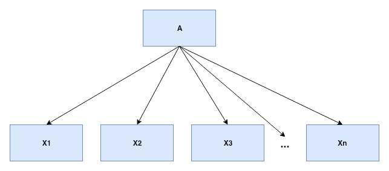
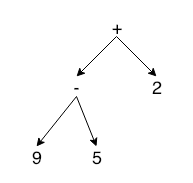

A context-free grammar can be used to help guide the translation of programs. 

Two forms of intermediate code representation is common: *abstract syntax tree* (AST), and *three-address instruction*.

In an AST, the syntax is represented in a hierarchical structure. In three-address instruction code, an instruction takes the form of `x = y op z`, where x, y, z are addresses, and op is the operand.

A three-address instruction carries out at most one operation -- a computation, comparison, or a branch.

### 2.2 - Syntax Definition

*Context-free grammar* is used to specify the syntax of the language. A grammar naturally describes the hierarchical structure of most programming language constructs.

For example, an if-else statement in Java:

```
if ( expression ) statement else statement
```

Can take on the form of:

```
stmt -> if ( expr ) stmt else stmt
```

The form above is said to be a *production*. In a production, lexical elements like keywords ('if', 'else', '(', ')') are said to be *terminals*. Variables like *expr* and *stmt* are *nonterminals*.

A context-free grammar has 4 components:

1. Set of terminal symbols referred to as tokens.
2. Set of non-terminals called syntactic variables.
3. Set of productions which are a sequence of terminals and/or non-terminals.
4. A start symbol.

A string of zero terminals, ϵ, is also called the empty string.

A grammar derives strings by beginning with the start symbol and repeatedly replacing a nonterminal by the body of a production for that nonterminal. 

Parsing is the problem of taking a string of terminals and figuring out how to derive it from the start symbol of the grammar.

A parse tree has the following properties:

1. Root is labeled by the start symbol.
2. Each leaf is labeled by either a terminal, or by ϵ.
3. Each interior node is labeled by a non-terminal.

```
A -> X1 X2 X3 ... Xn
```

Translates to:



A grammar is said to be *ambiguous* if a string can be derived by more than one parse tree.

### 2.3 - Syntax-Directed Translation

Two concepts related to syntax-directed translation:

1. Attributes - This is any quantity associated with the programming construct. They can be data types, number of instructions in the generated code, or the location of the first instruction.
2. (Syntax-directed) translation schemes - A translation scheme is a notation for attaching program fragments to the productions of a grammar. The program fragments are executed when the production is used during syntax analysis.

There are 3 ways to traverse a parse tree in a depth-first manner. Of course, they are your standard tree traversal algorithms: preorder, postorder and inorder.

Synthesized attributes is the idea of associating an attribute/quantity with programming constructs. A syntax-directed definition associates a given grammar symbol with a set of attributes, and with each production, a set of *semantic rules* for computing the values and the attributes associated with the symbols appearing in the production.

A semantic rule is evaluated at the appropriate node for each parse tree. An attribute is said to be synthesized if its value at a parse-tree node N is determined from attribute values at the children of N and at N itself. 

What makes a synthesized attribute special is that they have the property in that they can be evaluated during a single bottom-up traversal of a parse tree.

*Depth-first tree traversal* is the most commonly used method of tree traversal when it comes to the topic of compilers. There are several methods to perform a depth-first traversal:

1. In-order traversal. Visit the left child, root, and right child.
2. Pre-order traversal. Visit the root, left child, and right child.
3. Post-order traversal. Visit the left child, right child, and root.

Synonymously, we can also consider pre-order traversal as *performing the action* is done before we visit the node, and post-order traversal as the action being done after visiting the node. 

*Semantic actions* are program fragments embedded within production bodies. 

```
rest -> + term {print('+')} rest
```

### 2.4 - Parsing

For any context-free grammar, there is a parser that takes at most `O(n^3)` time to parse a string of `n` terminals. This is slow. Therefore, the grammar must be designed  to be parsed quickly. It is possible to parse linear time. To do this requires the parser implementation to do a left-to-right scan over the input, and perform a look-ahead of 1 terminal at a time while constructing the parse tree.

There are two classes of parse methods: (1) top-down, and (2) bottom-up.

For top-down parsers, the construction of the parse tree starts at the root and proceeds down towards the leaves. 

The pattern is like so:

1. At node N, labeled with a nonterminal A, select one of the productins for A and construct children at N for the symbols in the production body.
2. Find the next node at which the subtree is to be constructed, typically the leftmost unexpanded nonterminal of the tree.

For most grammars, you can do this with a single left-to-right scan of the string. 

The case is opposite for bottom up. Leaves are constructed first and move up to construct the root. 

Top-down parsers are usually much easier to construct, but bottom-up parsers can handle more classes of grammars.

Let's look at top-down parsers in more detail.

**Lookahead** - The current terminal being scanned in the input is the *lookahead* symbol. The initial lookahead is the first terminal of the input string.

For example:

Given the grammar:

```
stmt -> expr ;
    | if ( expr ) stmt
    | for ( optexpr ; optexpr ; optexpr ) stmt
    | other

optexpr -> ϵ
    | expr
```

```
for ( ; expr ; expr ) other
```

The `for` terminal would be the initial lookahead. We have a parse tree pointer, and lookahead symbol pointer to perform recursive descent parsing.

Recursive descent parsing uses a set of recursive procedures to process the input. 

Uses as set of procedures in that a single procedure is associated with each nonterminal of a grammar. A common method is predictive parsing.

In predictive parsing, the lookahead symbol unambiguously determines the flow of control. 

Basic example;

```
stmt -> for (optexpr ; optexpr ; optexpr ) stmt
```

The recursive descent parser would have a procedure to match this production with the following logic:

```
match('for'); match('('); 
optexpr(); match(';'); optexpr(); match(';'); optexpr(); 
match(')'); stmt();
```

Going back to the original grammar, we find that the first set of stmt: 

```
FIRST(stmt) = { expr, if, for, other }
```

We can design a predictive parser to function similar to:

```
void stmt() {
    switch(lookahead) {
        case expr:
            match(expr); match(';'); break;
        case if:
            match(if); match('('); match(expr); match(')'); stmt();
            break;
        case for:
            match(for); match('(');
            optexpr(); match(';'); optexpr(); match(';'); optexpr();
            match(')'); stmt(); break;
        case other:
            match(other); break;
        default:
            report("syntax error");
    }
}

void optexpr() {
    if(lookahead == expr) match(expr);
}

void match(terminal t) {
    if(lookahead == t) lookahead = nextTerminal;
    else report("syntax error");
}
```

Again, a predictive parser is a program that will execute a procedure for a nonterminal it encounters if it is a nonterminal. If it encounters a nonterminal, the following are performed:

* Given the nonterminal A, the predictive parser decides which production from A to use by examining the lookahead symbol. If α is the production body, and is not ϵ, and  the lookahead symbol is in FIRST(α), the lookahead symbol is processed.
* The procedure called will mimic the body of the chosen production. Each of the symbols within the production body are executed from left-to-right. When nonterminals are encountered, a procedure will be called for that nonterminal. In effect, this moves the lookahead symbol further.

The process completes successfully if the input is consumed and matched. Otherwise, a syntax error shall be reported.

What is left recursion? If your production looks like this:

```
expr -> expr + term
```

Then it is left recursive. It will then give the possibility in that the recursive descent parser will loop forever. 

The leftmost symbol of the body is the same as the nonterminal. This could lead to infinite recursive calls. Instead, we can rewrite the production to eliminate  
this infinite recursion. Use the form `A -> Aα | β`. 

So let's try and eliminate the infinite recursion by rewriting the `expr -> expr + term` production to fit the above.

```
expr -> expr + term

A = expr
α = + term
β = term
```

Written as `A -> Aα | β`, we have:

```
expr -> expr + term | term
```

Alternatively, we can convert it to right-recursive where R is a new production.

```
A -> βR 
R -> αR | ϵ

A = expr
α = + term
β = term
R = expr'

expr -> term expr' 
expr' -> + term expr' | ϵ
```

Visually, left recursion represents a tree growing deep on the left side. While, right-recursion represents a tree growing deep on the right side.

```

             /|
            / |
           /  |
          /___|

          Left Recursion

            |\
            | \
            |  \
            |___\
            
            Right Recursion
```

### 2.5 - A Translator for Simple Expressions

Book now discusses an example on how to build a simple syntax-directed translator in Java. The syntax-directed translator will output arithmetic expressions into postfix form.

Here is the following grammar with the semantic actions:

```
expr -> expr + term {print('+')}
    | expr - term {print('-')}
    | term
term -> 0 {print('0')}
    | 1 {print('1')}
    | 2 {print('2')}
    | 3 {print('3')}
    | 4 {print('4')}
    | 5 {print('5')}
    | 6 {print('6')}
    | 7 {print('7')}
    | 8 {print('8')}
    | 9 {print('9')}
```

But wait, the above grammar is actually *left-recursive*. We will ned to convert it.

To start creating a translator, we need a data structure. We will use an abstract syntax tree. 

In this tree:

1. The root is the operator. Either `+`, or `-`.
2. The children are the operands. Either `0, 1, ..., 9`.

Syntax tree for `9-5+2`:



These abstract syntax trees should not be confused with parse trees. In ASTs, the nodes are programming constructs, while in parse trees, they can represent nonterminals. 

Syntax tree = Abstract syntax tree.
Parse tree = Concrete syntax tree.

Example on how to convert entire grammar to remove left recursion:

Let `A = expr`. The left recursive productions we notice are:

```
expr -> expr + term
expr -> expr - term
```

To convert we need to transform into the form:

```
A -> γR
R -> αR | βR | ε	
```

To do so, define

```
A = expr
γ = term
```

We will then define a new production R:

```
α = + term
β = - term

R = expr'
```

Applying our rewrite rule, we can perform substitution to yield:
```
expr -> term expr'
expr' -> + term expr' 
    | - term expr' 
    | ε
```

The complete grammar with semantic-actions applied can then be:

```
expr -> term expr'
expr' -> + term {print('+')} expr' 
    | - term {print('-')} expr' 
    | ε
term -> 0 {print('0')} | ... | 9 {print('9')}
```

It then beecomes easier to construct a recursive descent parser. 

```
void expr() { ... }
void exprP() { ... }
void term() { ... }
```

See section 2.4 for a review on how this can be done. The interesting change here is that with a semantic action, we will inline the code to invoke the action. For example, in `+ term {print('+')} expr'`, the following shows what code could look like:

```
match('+'); 
term(); 

System.out.print("+"); 

exprP();
```

See [Code for Figure 2.27](code/fig227) for how this parser is implemented.

### 2.6 - Lexical Analysis

The lexical analyzer reads characters from the input and groups them into *token objects*.

A *token object* contains additional information in the form of attribute values. A *lexeme* is the single token.

A lexical analyzer can read from a buffer of characters, allowing it to be able to read ahead and make a decision in relation to the character. 

The grammar from the previous section can be extended to handle multiplication, division and identifiers. 

```
expr -> expr + term {print('+')}
    | expr - term   {print('-')}
    | term
term -> term * factor {print('*')}
    | term / factor {print('/')}
    | factor
factor -> ( expr )
    | num {print(num.value)}
    | id {print(id.lexeme)}
```

To make the grammar above not left-recursive, we can rewrite it to:

```
expr -> term expr'
    | term expr'
expr' -> + term {print('+')} expr
    | - term {print('-')} expr
    | ε

term -> factor term'
term' -> * factor {print('*')} term
    | / factor {print('/')} term
    | ε

factor -> ( expr )
    | num {print(num.value)}
    | id {print(id.lexeme)}
```

Lexical analyzers can be written to also remove white space and comments as a means to ignore them. This is handy because from all grammars we have seen so far, any sort of white space will "break" the parsing process.

To skip white space we first need to define what characters should be ignored. For our purposes: ` `, `\t`, and `\n` will be the characters to ignore.

Pseudo code for skipping white space:

```
for(;; peek = next input character) {
    if(peek is white space) do nothing;
    else break;
}
```

A lexical analyzer can read from a buffer of characters, allowing it to be able to read ahead and make a decision in relation to the character. 

For example, if `>` can be tokenized as `GREATER_THAN`, but the character can be followed by `=`, the token then is really, `>=`, which can correspond to `GREATER_THAN_OR_EQUAL`.

Lexical analyzers also group digits into numbers, and stream of characters into identifiers, or reserved keywords.

A stream, `31+28+59` is not tokenized as `<num, 3>, <num, 1>, <+>, ... <num, 5>, <num, 9>`, but `<num, 31>, <+>, <num, 28>, <+>, <num, 59>`.

The lexical analyzer can also determine whether a string of characters can be considered an identifier, or reserved keyword. The general approach is to check whether this string of characters falls into the table of reserved words. 

Generally, the analyzer will keep a *hash table* of words to check. A word can be a series of characters delimited by some whitespace. 

Approach to grouping digits into integers:

```
if(peek holds a digit) {
    v = 0;
    do {
        v = v * 10 + integer value of digit peek
        peek = next input character;
    } while(peek holds a digit);

    return token(num, v);
}
```

Approach to grouping letters as identifiers:

```
Hashtable() words = new Hashtable();

...

if(peek holds a letter) {
    collect letters or digits into a buffer b;
    s = string formed by the characters in b;
    w = token returned by words.get(s);

    if(w is not null) return w;
    else {
        enter the key-value pair (s, (id, s)) into words
        return token(id, s);
    }
}
```

Now, we can attempt to build a lexical analyzer.

See [Code for Lexical Analyzer in 2.6](code/lexer-example) for the implementation of the Lexical Analyzer which was built. It is reused in the exercises. 

To run:

```
cd lexer-example;
javac lexer/*.java && javac Driver.java
java Driver
```

Example:

```
Rogers-MacBook-Pro:lexer-example rogerngo$ java Driver
Enter input: testId
Token tag: ID
```

### 2.7 - Symbol Tables

### 2.8 - Intermediate Code Generation

