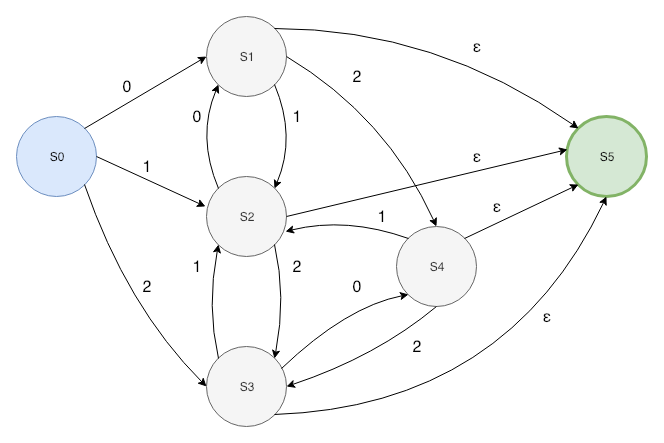

**Exercise 3.1.1: Divide the following C++ program:**

```
float limitedSquare(x) float x {
    /* returns x-squared, but never more than 100 */
    return (x<=10.0||x>=10.0)?100:x*x;
}
```

**into appropriate lexemes, using the discussion of Section 3.1.2 as a guide. Which lexemes should get associated lexical values? What should those values be?**

```
<float>
<id, "limitedSquare">
<(>
<id, "x">
<)>
<float>
<id, "x">
<{>
<return>
<(>
<id, "x">
<comparison, "<=">
<number, 10.0>
<op, "||">
<id, "x">
<comparison, ">=">
<number, 10.0>
<)>
<op, "?">
<number, 100>
<op, ":">
<id, x>
<op, "*">
<id, x>
<}>
```

**Exercise 3.1.2: Tagged languages like HTML or XML are different from conventional programming languages in that the punctuation (tags) are either very numerous (as in HTML), or user-definable set (as in XML). Further, tags can often have parameters. Suggest how to divide the following HTML document:**


```
Here is a photo of <B>my house</B>:
<P><BR>
See <A HREF = "morePix.html">More Pictures</A> if you liked that one.<P>
```

**into appropriate lexemes. Which lexemes should get associated lexical values, and what should those values be?**

```
<literal, "Here is a photo of">
<tagStart, "B">
<literal, "my house">
<tagEnd, "B">
<literal, ":">
<tagStart, "P">
<tag, "IMG">
<tagAttribute, "SRC">
<=>
<attributeValue, ""house.gif"">
<tag, "BR">
<literal, "See">
<tagStart, "A">
<tagAttribute, "HREF">
<=>
<attributeValue, ""morePix.html"">
<literal, "More Pictures">
<tagEnd, "A">
<literal, "if you liked that one.">
<tagEnd, "P">
```

**Exercise 3.3.1: Consult the langauge reference manuals to determine (i) the sets of characters that form the input alphabet (excluding those that may only appear in character strings or comments), (ii) the lexical form of numerical constants, (iii) the lexical form of identifiers, for each of the following languages: (a) C (b) C++ (c) C# (d) Fortran (e) Java (f) Lisp (g) SQL**

* C
    * Input Alphabet: ASCII character set
    * Numerical Constants: `(+|-)?(digit)(.)?(digit)*(E)?(+|-)?(digit)*`
    * Identifiers: `letter_(letter_|digit)*`
* C++
    * Input Alphabet: ASCII character set
    * Numerical Constants: `(+|-)?(digit)(.)?(digit)*(E)?(+|-)?(digit)*`
    * Identifiers: `letter_(letter_|digit)*`
* C#
    * Input Alphabet: ASCII character set
    * Numerical Constants: `(+|-)?(digit)(.)?(digit)*(E)?(+|-)?(digit)*`
    * Identifiers: `(@)?(letter_)(letter_|digit)*`
* Fortran
    * Input Alphabet: ASCII character set
    * Numerical Constants: `(+|-)?(digit)(.)?(digit)*(E)?(+|-)?(digit)*`
    * Identifiers: `(letter)(letter_|digit)...(letter_|digit)`
        * Note: 31 character limit
* Java
    * Input Alphabet: ASCII character set
    * Numerical Constants: `(+|-)?(digit)(.)?(digit)*(E)?(+|-)?(digit)*`
    * Identifiers: `letter_(letter_|digit)*`
* Lisp
    * Input Alphabet: ASCII character set
    * Numerical Constants: `(+|-)?(digit)(.)?(digit)*(E)?(+|-)?(digit)*`
    * Identifiers: Most sequence of characters will be read as a identifier if not a number or all dots.
* SQL
    * Input Alphabet: ASCII character set
    * Numerical Constants: `(+|-)?(digit)(.)?(digit)*(E)?(+|-)?(digit)*`
    * Identifiers: `(lettter_@#)(letter|number|@|$|_)`

**Exercise 3.3.2: Describe the languages denoted by the following regular expressions:**

a) `a(a|b)*a`
b) `((ε|a)b*)*`
c) `(a|b)*a(a|b)(a|b)`
d) `a*ba*ba*ba*`
**!!** e) `(aa|bb)*((ab|ba)(aa|bb)*(ab|ba)(aa|bb)*)*`

a) This language defines all strings must begin with `a` followed by any number of characters in `{a, b}` and must end with `a`.
b) This language defines all strings that consists of `a` and `b` in any sequence.
c) Defines any strings that must contain `a` as the third to last character.
d) Defines any strings that must begin with an `a` and end with `ba`.
e) Defines strings which contain an even number of `a` and `b`.

**Exercise 3.3.3: In a string of length *n*, how many of the following are there?**

a) Prefixes
b) Suffixes
c) Proper Prefixes
**!** d) Substrings
**!** e) Subsequences

Remember to consider ε...

a) `n + 1`
b) `n + 1`
c) `n - 1`
d) `C(n + 1, 2) + 1`
e) `Σ(i = 0 -> n) C(n, i)`

**Exercise 3.3.4: Most languages are case sensitive, so keywords can be written only one way, and the regular expressions describing their lexemes are very simple. However, some langauges, like SQL, are case insensitive, so a keyword can be written either lowercase or in uppercase, or in any mixture of cases. Thus, the SQL keyword `SELECT` can be written `select`, `Select`, or `sElEcT`, for instance. Show how to write a regular expression for a keyword in a case-insensitive language. Illustrate the idea by writing the expression for "select" in SQL.**

A keyword is generally going to be fixed as a finite sequence of characters. For example, suppose `select` is a keyword. Then the regular expression would be: `(s)(e)(l)(e)(c)(t)`. To make it case insensitive, it would be:

```
(S|s)(E|e)(L|l)(E|e)(C|c)(T|t)
```

**Exercise 3.3.5: Write regular definitions for the following languages:**

a) All strings of lowercase letters that contain the five vowels in order.

```
string -> nonVowels* a (nonVowels|a)* e (nonVowels|e)* i (nonVowels|i)* o (nonVowels|o)* u (nonVowels|u)*
nonVowels -> [bcdfghjklmnpqrstvwxyz]
```

b) All strings of lowercase letters in which the letters are in ascending lexicographic order.

```
a*b*c*d*e*f*g*h*i*j*k*l*m*n*o*p*q*r*s*t*u*v*w*x*y*z*
```

c) Comments, consisting of a string surrounded by `/*` and `*/`, without an intervening `*/`, unless it is inside double-quote `"`.

```
comment -> (/)(*) other* (*)(/)
other -> (")(*)(/)(") | letter | digit
```
**!!** d) All strings with digits with no repeated digits. *Hint*: Try this problem first with a few digits, such as {0, 1, 2}.

This one is complicated to represent by RegEx, so here is an NFA to show the transitions:



**!!** e) All strings of digits with at least one repeated digit.

**!!** f) All strings of a's and b's with an even number of a's and an odd number of b's. 

g) The set of Chess moves, in the information notation, such as `p-k4` or `kbpXqn`.

**!!** h) All strings of a's and b's that do not contain the substring *abb*.

i) All strings of a's and b's that do not contain the subsequence *abb*.

`b*a*b?a*`

**Exercise 3.3.6: Write chracter classes for the following sets of characters:**

a) The first ten letters (up to "j") in either upper or lower case.

`[A-Ja-j]`

b) The lower case consonants.

`[b-d|f-h|j-n|p-t|v-z]`

c) The "digits" in a hexadecimal number (choose either upper or lower case for the "digits" above 9).

`[0-9A-F]`

d) The characters that can appear at the end of a legitimate English sentence (e.g., exclamation point).

`.|?|!`

**Exercise 3.3.7: Note that these regular expressions give all the following symbols (operator characters) special meaning:**

`\ " . ^ $ [ ] * + ? { } | /`

**Their special meaning must be turned off if they are needed to represent themselves in a character string. We can do so by quoting the character within a string of length one or more; e.g., the regular expression `"**"` matches the string `**`. We can also get the literal meaning of an operator character by preceding it by a backslash. Thus, the regular expression `\*\*` also matches the string `**`. Write a regular expression that matches the string `"\`.**

Following the same rules stated above we can write the regex as: `[\"\\]`
