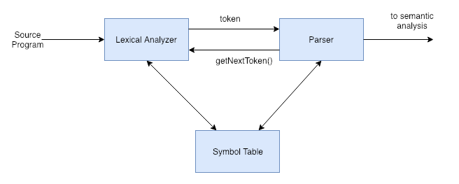

### Lexical Analysis

* Regular expressions
* Deterministic automata
* Non-deterministic automata

### 3.1 - The Role of the Lexical Analyzer

Lexical analysis - First phase of the compiler.

The main task is to read input of character of the source program, and group them into lexemes. The lexemes are then produced as output, a series of tokens. 

The tokens are sent to the parser for syntax analysis.

Lexical analyzer can also interact with the symbol table. 

In general, it is common that a parser interacts with the lexical analyzer by calling some sort of function exposed by the lexical analyzer such as `getNextToken()`. Then returned result is a token from the lexical analyzer.

The parser will repeatedly do this until there is no more input from the source program.



The lexical analyzer can also keep track of the number of `\n` characters sen so that it can associate a line number with each error message. 

Macro expansion can also be performed by the lexical analyzer. 

Lexical analyzers are divided into a cascade of 2 processes:

a) Scanning - consists of simple processes that do not require tokenization of the input. (Deletion of comments, compaction of consecutive whitespace characters into 1, etc)
b) Lexical analysis - Produces tokens from the output of the scanner.

Lexical Analysis and parsing are usually separate phases for various reasons:

1. Separating lexical analysis, and implementing it in a lexical analyzer keeps both the lexical analyzer and parser simple. Each will have its own special task to worry about, and thus simpler and easier-to-understand designs.
2. Compilier efficiencies. We can spend more time to optimize various parts of the lexical analyzer, not having to worry about avoiding touching the parsing logic.
3. Compiler portability. Input-device-specific peculiarities can be restricted to the lexical analyzer.

Tokens, Patters, and Lexemes. What's the difference?

* A **token** is a pair consisting of a token name and an optional attribute value. The token name is an abstract symbol representing a kind of lexical unit -- keywords, identifier, etc.
* A **pattern** is the form of what the lexemes of a token can take. For example, a pattern for an identifier would be a lexeme that begins with a letter, followed by a series of letters and numbers.
* A **lexeme** is a sequence of characters in the source program which matches a pattern for a token. 

Example:

```
printf("Total = %d\n", score);
```

`printf`, `score` = lexemes with pattern matching to *id*.

`"Total = %d\n"` is a lexeme matching *literal*.

Usually, the lexical analyzer not only returns just the token type to the parser, but also the token attribute value as it is useful for other operations and/or for manipulation of the symbol table.

### 3.2 - Input Buffering

Sometimes you need to look at one character ahead. A clean way to solve this is to buffer the input for processing.

A buffering technique:

* Use a buffer of size *N*. *N* can be the size of a disk block (4096 bytes, for example)
* A system call to read will return the N characters into the buffer. If there are fewer than N characters, then **eof** character will indicate the end of file.

While processing the input, we can use 2 pointers:

1. A *lexemeBegin* pointer to mark the beginning of the current lexeme. This is the extent in which we are attempting to determine.
2. A *forward* pointer to move ahead until a pattern match is found. 

The *forward* pointer moves until a pattern match is found for a lexeme. Upon doing so, it is set to the character at its right end. Then set *lexemeBegin* to the character immediately after the lexeme just found.

Keep advancing until the `EOF` character has been encountered. 

### 3.3 - Specification of Tokens

Regular expressions are a way to specify the patterns for tokens.

* *alphabet* is a set of symbols.
* *string* is a sequence of symbols drawn from the alphabet.
* *language* is a countable set of strings over some fixed alphabet. 

Given `x` and `y`:

* concatenation
    * `xy`
* exponentiation
    * `x^2y` = `xxy`

The Kleene closure of a language L is denoted by L*. (L concatenated zero or more times)

The positive closure is denoted by L+, which is L* - L^0. (At least one occurrence of L)

Example of a regular expression which defines an identifier in C:

```
letter_(letter_ | digit)*
```

Where, *letter_* is represented by `a-z`, `A-Z`, and `_`.

Regular expressions can be built recursively out of smaller regular expressions using basic rules:

1. ε is a regular expression, and L(ε) is {ε}, that is, the language whose sole member is the empty string.
2. If a is a symbol in Σ, then **a** is a regular expression, and L(**a**) = {*a*}, that is, the language with one string, of length one with *a* in its one position.

(1) and (2) are considered to be the basis, or base case in the recursive procedure. 

Precedence level from highest to lowest:

1. Unary `*`
2. Concatenation
3. `|`

`(a)|((b)*(c))` is therefore simplified to: `a|b*c`.

Regular expressions also follows algebraic laws such as commutativity, associativity and idempotency.

